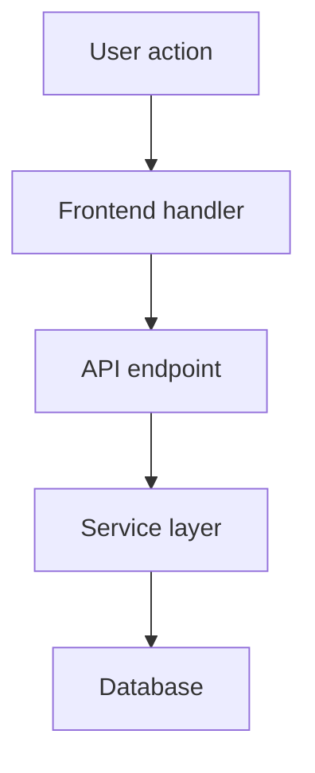

# Architecture And Decisions Reference

Read this when writing, reviewing, or improving architecture docs, code-flow docs, module ownership docs, package/library notes, execution-flow diagrams, or ADRs.

## Code Architecture Docs

Architecture docs explain how the code actually works now.

Recommended structure:

```text
docs/docs/architecture/
  index.md
  backend.md
  frontend.md
  cli.md
  data-model.md
  execution-flows.md
  integrations.md
  packages-and-libraries.md
```

Architecture docs should explain main modules, entry points, data flow, execution flow, important conditions, important loops, package choices, design trade-offs, and diagrams.

Good architecture docs answer:

* Where does the flow start?
* Which function, class, or module owns the logic?
* What is executed first, next, and last?
* What branches or conditions matter?
* What data is read, transformed, saved, or returned?
* Which libraries and packages are used and why?
* Which files should be updated together?

Use Mermaid or D2 diagrams when they clarify flows:

````md


```d2
User action -> Frontend handler
Frontend handler -> API endpoint
API endpoint -> Service layer
Service layer -> Database
```
````

Do not put long architecture explanations into `AGENTS.md`.

## ADR Docs

Use `docs/docs/adr/` for decision logs.

ADRs should record:

* The important technical decision.
* Why it was made.
* Alternatives considered.
* Consequences and trade-offs.
* Relevant code paths, docs, or references.

Use architecture docs for how the system works now. Use ADRs for why an important technical decision was made.
